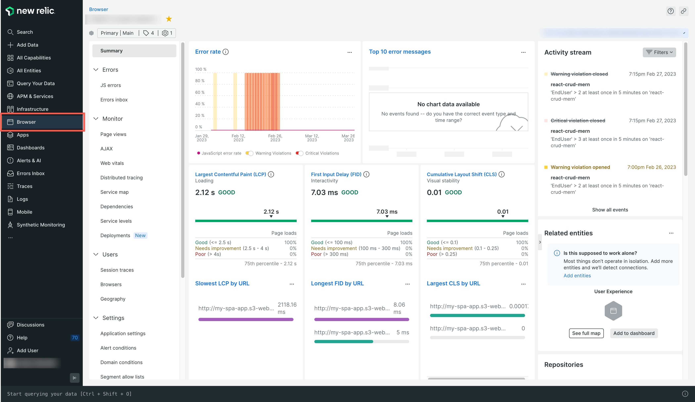
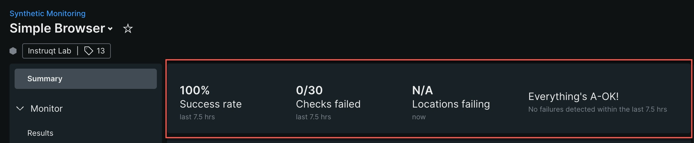
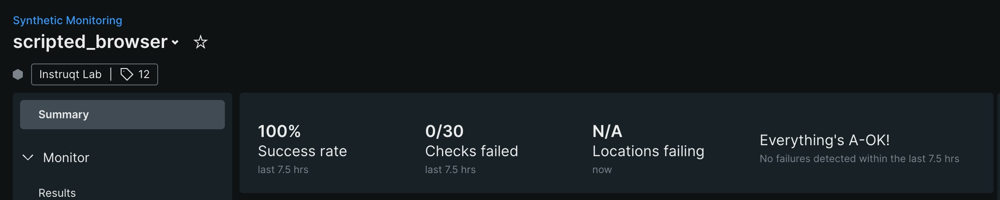

# 🔭 Full Stack Observability Workshop with New Relic

## Introduction

Welcome to the **Full Stack Observability Workshop**! In this hands-on workshop, you'll instrument a Fullstack JavaScript application (PostgreSQL, Express, React, Node.js) with New Relic for end-to-end observability.

### What you'll learn

| # | Challenge | What you'll do | Time |
|---|-----------|---------------|------|
| 0 | **Validate** | Confirm your environment is working | ~5 min |
| 1 | **APM** | Instrument a Node.js/Express API with Application Performance Monitoring | ~10 min |
| 2 | **Infrastructure** | Install the New Relic Infrastructure agent to monitor the underlying host | ~10 min |
| 3 | **Log Forwarding** | Configure custom log forwarding via the Infrastructure agent | ~10 min |
| 4 | **Browser** | Instrument a React SPA with New Relic Browser for Real User Monitoring | ~10 min |
| 5 | **Synthetics** | Set up proactive monitoring with Synthetic checks | ~10 min |
| 6 | **Troubleshooting** | Find and fix 5 injected bugs using New Relic (Bonus) | ~15 min |
| | | **Total (core, excluding bonus)** | **~55 min** |

### Prerequisites

- A free [New Relic account](https://newrelic.com/signup)
- A GitHub account with Codespaces access

### Getting Started

1. Open this repository in **GitHub Codespaces**:
   - Click the green **`<> Code`** button → **Codespaces** tab → **Create codespace on main**
2. Wait for the environment to finish building (2–3 minutes). The setup script will:
   - Install all Node.js dependencies
   - Initialize the PostgreSQL database with sample data
   - Make the app ready to run
3. When you see `✅ Workshop environment is ready!` in the terminal, you're good to go!

> [!TIP]
> You will need **two terminals** for most exercises. Use the **`+`** button in the VS Code terminal panel (or press `` Ctrl+Shift+` ``) to open additional terminals.

---

## Step 0 – Validate Your Environment ⏱️ *~5 min*

Before starting any challenges, confirm the app runs correctly.

### Start the App

**Terminal 1** — Start the backend:

```bash
cd packages/backend
npm start
```

You should see: `Server is running on port 8080.`

**Terminal 2** — Start the frontend:

```bash
cd packages/frontend
npm start
```

You should see Vite output with: `Local: http://localhost:3000/`

### Verify Everything Works

1. **API check** — In Terminal 2 (or a third terminal), run:

   ```bash
   curl http://localhost:8080/api/tutorials
   ```

   You should see a JSON array of tutorial data.

2. **Frontend check** — Open port **3000** from the **Ports** tab (or visit `http://localhost:3000` locally). You should see the Tutorials app with a list of tutorials.

3. **Navigate the app** — Click a tutorial, check the sidebar, try adding a new tutorial. Everything should work without errors.

### Troubleshooting

| Problem | Fix |
|---------|-----|
| `Cannot connect to the database` | Check that PostgreSQL is running: `pg_isready -h localhost -p 5432 -U postgres` |
| Frontend shows a blank page | Check the browser console for errors. Make sure `.env.local` has the correct `VITE_APP_API_URL`. |
| Port conflict | Another process may be using port 3000 or 8080. Run `lsof -i :3000` or `lsof -i :8080` to find it. |
| Setup script didn't run | Run `bash .devcontainer/setup.sh` manually. |

Once everything is working, **stop both servers** with `Ctrl+C` in each terminal. You're ready to begin!

<!-- TODO: Add screenshot of the running Tutorials app UI -->

---

## Challenge 1 – Instrument Node.js with APM ⏱️ *~10 min*

New Relic's Application Performance Monitoring (APM) tracks the performance of your applications and microservices. With APM, you can monitor web transaction times, throughput, and all dependencies. This challenge demonstrates how to instrument a Node.js Express API.

> [!NOTE]
> If you completed **Step 0**, your environment is verified. Proceed directly to Step 1.

### Step 1 – Verify the `newrelic` NPM package

The `newrelic` Node.js agent package is already installed as part of the setup script. You can verify it's in `package.json`, or re-run:

```bash
npm install newrelic
```

### Step 2 – Configure `newrelic.js`

Open the file `packages/backend/newrelic.js` in the VS Code editor.

Update the following configuration values:

- **`app_name`** — Give your application a unique name (e.g., `'my-pern-workshop'`)
- **`license_key`** — Paste your **New Relic Ingest License Key**

> [!NOTE]
> To locate your Ingest License Key, refer to [New Relic API keys](https://docs.newrelic.com/docs/apis/intro-apis/new-relic-api-keys/)

Save the file once updated.

### Step 3 – Enable APM in your Node service

Open the file `packages/backend/server.js` and add the following line at the **very top** (line 1):

```javascript
const newrelic = require('newrelic');
```

This ensures New Relic APM hooks into your application when it starts.

### Step 4 – Start the service & generate data

**Terminal 1** — Start the backend with New Relic enabled:

```bash
cd packages/backend
npm run start:nr
```

**Terminal 2** — Generate traffic by running the load generator:

```bash
cd packages/backend
npm run load
```

> [!NOTE]
> Press `Esc` or `Ctrl+C` to stop the load generator after a minute or two.

### Step 5 – Verify APM in New Relic

Head to **[New Relic](https://one.newrelic.com/) → APM & Services**. You should see an entity with your chosen application name.

> [!NOTE]
> It can take a few minutes for the service to appear in the New Relic UI.


> [!TIP]
> **Checkpoint:** Before continuing, confirm you can see your app name listed under **APM & Services** in New Relic. If it's not there yet, wait a couple more minutes and refresh.

---


## Challenge 2 – Instrument the Host with Infrastructure ⏱️ *~10 min*

New Relic Infrastructure monitoring offers flexible, dynamic observability for your entire infrastructure. It enables you to track the health and performance of hosts — whether physical machines, VMs, or containers.

In this challenge, you will manually install the Infrastructure agent — the same steps you'd run on any Linux host in production.

> [!TIP]
> You do **not** need to stop the servers from Challenge 1. Keeping them running will continue to generate APM data while we set up Infrastructure monitoring!

### Step 1 – Configure your license key

Create the agent configuration file with your New Relic license key:

```bash
sudo tee /etc/newrelic-infra.yml > /dev/null <<EOF
license_key: YOUR_LICENSE_KEY_HERE
custom_attributes:
  environment: codespaces
  project: pern-newrelic
EOF
```

Replace `YOUR_LICENSE_KEY_HERE` with your actual New Relic license key (found under **Profile → API Keys → License key**).

### Step 2 – Add the New Relic APT repository

```bash
curl -s https://download.newrelic.com/infrastructure_agent/gpg/newrelic-infra.gpg \
  | sudo gpg --dearmor -o /etc/apt/trusted.gpg.d/newrelic-infra.gpg

CODENAME=$(grep VERSION_CODENAME /etc/os-release | cut -d= -f2)
echo "deb [arch=$(dpkg --print-architecture)] https://download.newrelic.com/infrastructure_agent/linux/apt $CODENAME main" \
  | sudo tee /etc/apt/sources.list.d/newrelic-infra.list
```

### Step 3 – Install and start the agent

```bash
sudo apt-get update && sudo apt-get install -y newrelic-infra

sudo /usr/bin/newrelic-infra > /tmp/newrelic-infra.log 2>&1 &
```

> [!NOTE]
> In production you would use `systemctl enable --now newrelic-infra`. In Codespaces we run the binary directly — same process, different lifecycle manager.

### Step 4 – Verify the agent is running

```bash
# Confirm the process is alive
ps aux | grep newrelic-infra

# Tail the log to see live output
tail -f /tmp/newrelic-infra.log
```

Press `Ctrl+C` to stop tailing the log when you're done.

### Step 5 – Verify Infrastructure data in New Relic

Head to your New Relic account → **Infrastructure → Hosts**. You should see a new host entity appearing.

> [!NOTE]
> It may take a few minutes before data appears in the dashboard.


> [!TIP]
> **Checkpoint:** Confirm you can see a host entry under **Infrastructure → Hosts** in New Relic before moving on.

---

## Challenge 3 – Configure Log Forwarding ⏱️ *~10 min*

Monitoring logs is essential with modern cloud-based applications. New Relic's log management platform provides fast, scalable solutions that connect your logs with the rest of your telemetry data.

In this challenge, we'll leverage the Infrastructure agent (installed in Challenge 2) to forward logs to New Relic.

### Step 1 – Create a custom logging configuration

```bash
sudo touch /etc/newrelic-infra/logging.d/dummy-logging.yml
```

### Step 2 – Add logging configuration

Open the file `/etc/newrelic-infra/logging.d/dummy-logging.yml` in VS Code and add the following:

```yaml
logs:
  - name: dummy-logs
    file: /tmp/dummy.log # Path to a single log file
```

Save the file.

### Step 3 – Restart the Infrastructure agent

Stop the running agent and restart it to pick up the new config:

```bash
# Find and stop the running agent
sudo pkill -f newrelic-infra

# Start it again
sudo /usr/bin/newrelic-infra -config /etc/newrelic-infra.yml > /tmp/newrelic-infra.log 2>&1 &
```

### Step 4 – Generate dummy logs

Run the `flog` utility (pre-installed in this Codespace) to generate sample log data:

```bash
flog -t log -n 2000 -d 0.5 -o /tmp/dummy.log -w
```

> [!NOTE]
> Press `Ctrl+C` to stop log generation after a minute.

### Step 5 – Verify your logs in New Relic

Head to your New Relic account → **Logs** in the left panel. You should see your `dummy-logs` appearing.

> [!NOTE]
> It may take a few minutes before logs show up.


### Bonus – Automatic Logs in Context

When you set up the APM agent (Challenge 1), it automatically captures contextual logging from your Node service during runtime. You can view these logs alongside distributed traces:

1. Go to your APM app in New Relic
2. Select **Distributed Tracing**
3. Choose any trace
4. Switch to the **Logs** tab — you'll see logs from that specific trace


> [!TIP]
> **Checkpoint:** Confirm you can see `dummy-logs` entries under **Logs** in New Relic before moving on.

---

## Challenge 4 – Frontend Real User Monitoring with Browser ⏱️ *~10 min*

New Relic Browser enables you to monitor real user activity in your web application. By adding a small JavaScript snippet to your React app, you gain visibility into page load times, JS errors, AJAX calls, and session traces.

In this challenge you'll do all the configuration first, then start the app once.

### Step 1 – Configure the Frontend API URL

Your Codespace assigns a **unique public URL** for each forwarded port. The React app needs this to reach the backend.

1. Open the **Ports** tab at the bottom of VS Code (next to the Terminal tab)
2. Find port **8080** (labeled "Backend (Node/Express)")
3. Right-click → **Copy Local Address** — it will look like `https://<codespace-name>-8080.app.github.dev`
4. Open `packages/frontend/.env.local` and update the `VITE_APP_API_URL` line:

<!-- TODO: Add screenshot of the Ports tab showing port 8080 -->

```bash
PORT=3000
NODE_ENV=development
VITE_APP_API_URL='https://<codespace-name>-8080.app.github.dev/api'
```

> [!IMPORTANT]
> Replace `<codespace-name>-8080.app.github.dev` with the URL you just copied. Make sure to include `/api` at the end.

Save the file.

### Step 2 – Add the Browser SPA Agent snippet

Before starting the app, let's also add the Browser agent so you only need to start once.

1. Go to [one.newrelic.com](https://one.newrelic.com/) → **Add data** (left panel) → **Browser & Mobile**
2. Select **React** as the data source
3. Choose **Copy/Paste JavaScript code** as the deployment method

   

4. Scroll to the bottom → Select **No (Name your standalone app)** → Enter a name → Click **Enable**
5. **Copy** the generated JavaScript snippet

   

6. Open `packages/frontend/index.html` in VS Code
7. Paste the snippet inside the `<head>` section

Save the file.

### Step 3 – Start both apps & generate traffic

Now that both configurations are in place, start everything:

**Terminal 1** — Start the backend (with New Relic):

```bash
cd packages/backend
npm run start:nr
```

**Terminal 2** — Start the frontend:

```bash
cd packages/frontend
npm start
```

Once running:
1. Open the **Ports** tab → find port **3000** → click the 🌐 globe icon (or right-click → **Open in Browser**)
2. You should see the Tutorial app
3. Click around — view tutorials, add one, navigate between pages — to generate Browser telemetry

> [!NOTE]
> Make sure the backend server is running before accessing the web app.

### Step 4 – Verify Browser data in New Relic

Head to **New Relic → Browser** in the left panel. You should see your browser application.



> [!NOTE]
> It may take up to 5 minutes for data to appear.

> [!TIP]
> **Checkpoint:** Confirm you can see your browser app listed under **Browser** in New Relic before moving on.

---

## Challenge 5 – Proactive Monitoring with Synthetics ⏱️ *~10 min*

New Relic Synthetic monitoring lets you proactively detect and resolve issues before they impact your customers. Synthetic monitors simulate user journeys and test API endpoints from locations around the world.

> [!IMPORTANT]
> For Synthetics to reach your Codespace app, the port must be set to **public**. This is already configured in the devcontainer, but verify by checking the **Ports** tab — port 3000 should show a 🌐 globe icon (visibility: Public).

### Get your Frontend Public URL

In the **Ports** tab, find port **3000** → Right-click → **Copy Local Address**. This is the URL you'll use for Synthetics.

It will look like: `https://<codespace-name>-3000.app.github.dev`

> [!NOTE]
> Make sure both your frontend and backend services are running before setting up monitors.

### Simple Browser Monitor

A Simple Browser check tests a full page load and provides resource breakdowns and timelines.

1. Go to New Relic → [Synthetic monitoring](https://one.newrelic.com/synthetics-nerdlets) → **Create Monitor**
2. Choose **Page Load Performance**
3. Enter a **Name** for your monitor
4. Paste your **Codespace Frontend URL** in the URL field
5. Choose **one** location
6. Click **Save**


Wait a few minutes for the checks to complete. You'll see success/failure results on the Summary screen.



### Scripted Browser Monitor

Scripted browser monitors allow sophisticated, customized monitoring with navigation flows and assertions.

1. Go to Synthetic monitoring → **Create Monitor**
2. Choose **User flow / functionality**
3. Enter a **Name**
4. Choose **one** location
5. In the **Write Script** section, replace all contents with the script below

> [!IMPORTANT]
> 1. Ensure you have **at least 3 tutorials** created in your app, otherwise the script below will fail trying to click the 3rd row.
> 2. Update the `URL` variable in the script with your Codespace Frontend URL before saving.

```javascript
// Generated by Selenium IDE
// New Relic Synthetics Formatter for Selenium IDE
// https://docs.newrelic.com/docs/synthetics/new-relic-synthetics/scripting-monitors/writing-scripted-browsers

  const assert = require("assert");
  const urlRequest = require("urllib").request;
  // Theshold for duration of entire script - fails test if script lasts longer than X (in ms)
  // Script-wide timeout for all wait and waitAndFind functions (in ms)
  var DefaultTimeout = 30000;
  // Change to any User Agent you want to use.
  // Leave as "default" or empty to use the Synthetics default.
  var UserAgent = "default";
  const URL = "<PASTE YOUR CODESPACE URL HERE>";
  const By = $driver.By;
  const browser = $browser.manage();
  var vars = new Map();
  const logger = function({timeout:e=18e4,stepLogging:t=!1,insightsKey:n=""}){const r=Date.now();var s=0,o="",i=0,a=0;function l({step:e=0,msg:t="",duration:r=0,eventType:s="SyntheticsCustom",custom:o={}}){if(void 0===n||""==n)return;var i={method:"POST",headers:{"X-Insert-Key":n,"Content-Type":"application/json"},data:{eventType:s,step:e,message:t,duration:r,JOB_ID:$env.JOB_ID,MONITOR_ID:$env.MONITOR_ID,ACCOUNT_ID:$env.ACCOUNT_ID,LOCATION:$env.LOCATION,PROXY_HOST:$env.PROXY_HOST,PROXY_PORT:$env.PROXY_PORT},dataType:"text"};const a=`https://insights-collector.newrelic.com/v1/accounts/${$env.ACCOUNT_ID}/events`;i.data=Object.assign({},i.data,o),urlRequest(a,i)}function c(e,t,n=""){e>a&&0!=a&&_({testCase:n});let i=`Step ${e}: ${t} STARTED at ${s=Date.now()-r}ms. testCase=${n}`;console.log(i),o=t,a=e}function _({testCase:i=""}){var c=Date.now()-r,_=c-s;if(console.log(`Step ${a}: ${o} FINISHED. It took ${_}ms to complete. testCase=${i}`),t&&n.length>0?l({step:a,msg:o,duration:_,custom:{testCase:i}}):t&&$util.insights.set(`Step ${a}: ${o}`,_),e>0&&c>e)throw new Error("Script timed out. "+c+"ms is longer than script timeout threshold of "+e+"ms.")}return{logStep:function(e){c(i++,e)},log:c,getStep:function(){return i},end:_,endTestCase:function(e=""){var i=Date.now()-r-s;console.log(`Step ${a}: ${o} FINISHED. It took ${i}ms to complete.`),t&&n.length>0?l({step:a,msg:o,duration:i,custom:{testCase:e}}):t&&$util.insights.set(`Step ${a}: ${o}`,i),$util.insights.set("testCase",e),$util.insights.set("testCaseStatus","Pass"),t&&n.length>0&&l({eventType:"SyntheticsTests",custom:{testCase:e,testCaseStatus:"Pass"}})},error:function(e,r=""){console.log(`Error in Step ${a}: ${o}`),$util.insights.set("errorStep",""+a),$util.insights.set("errorMsg",e.message),$util.insights.set("errorLineNumber",e.lineNumber),$util.insights.set("testCase",r),$util.insights.set("testCaseStatus","fail"),t&&n.length>0&&l({eventType:"SyntheticsTests",custom:{testCase:r,testCaseStatus:"Fail"}})},postInsights:l}}({})
  $browser.getCapabilities().then(function () { })
  // Test Case: app-edit_item_change_status
  .then(function (){
  	return Promise.resolve(true)

    .then( function(){return logger.log(1,`Open URL ${URL}`,"app-edit_item_change_status"),$browser.get(`${URL}`).then(e=>e)})
    .then( function(){return logger.log(2,"Set Window Size Width=1686 Height=1055","app-edit_item_change_status"),$browser.manage().window().setSize(1686,1055).then(e=>e)})
    .then( function(){return logger.log(3,"Mouse move","app-edit_item_change_status"),$browser.waitForAndFindElement(By.css("tr:nth-child(3) .p-button-info"),DefaultTimeout).then(e=>Promise.resolve($browser.actions().mouseMove(e).perform()))})
    .then( function(){return logger.log(4,"Mouse out By.tagName(\"body\")","app-edit_item_change_status"),$browser.waitForAndFindElement(By.tagName("body"),DefaultTimeout).then(e=>Promise.resolve($browser.actions().mouseMove(e,0,0).perform()))})
    .then( function(){return logger.log(5,"Click By.css(\"tr:nth-child(3) .p-button-info > .p-button-icon\")","app-edit_item_change_status"),$browser.waitForAndFindElement(By.css("tr:nth-child(3) .p-button-info > .p-button-icon"),DefaultTimeout).then(e=>(e.click(),Promise.resolve(!0)))})
    .then( function(){return logger.log(6,"Click By.xpath(\"//div[@id='root']/div/main/div/div[2]/div[2]/div/button[2]/span[2]\")","app-edit_item_change_status"),$browser.waitForAndFindElement(By.xpath("//div[@id='root']/div/main/div/div[2]/div[2]/div/button[2]/span[2]"),DefaultTimeout).then(e=>(e.click(),Promise.resolve(!0)))})
    .then( function(){return logger.log(7,"Click By.css(\".p-button-outlined > .p-button-label\")","app-edit_item_change_status"),$browser.waitForAndFindElement(By.css(".p-button-outlined > .p-button-label"),DefaultTimeout).then(e=>(e.click(),Promise.resolve(!0)))})
    .then( function(){return logger.log(8,"Close Browser","app-edit_item_change_status"),Promise.resolve($browser.close())})
  	.then(function() {
  		logger.endTestCase("app-edit_item_change_status");
  	}, function(err) {
  		logger.error (err, "app-edit_item_change_status");
  		throw(err);
  	});

  })
```

Validate the script, then save. Wait a few minutes for the monitor to run.


If all steps were followed correctly, you should see results like this:



> [!TIP]
> **Checkpoint:** Confirm you can see green check marks on both your **Simple Browser** and **Scripted Browser** monitors under **Synthetic Monitoring** in New Relic.

---

## Challenge 6 – Troubleshooting with New Relic (Bonus) ⏱️ *~15 min*

We've secretly injected **5 realistic bugs** into this application. Now that you have New Relic instrumented across the stack, your final challenge is to find them, diagnose the root cause, and fix the code!

<!-- TODO: Add screenshot of APM Errors inbox or Browser JS Errors view showing error signals -->

> [!TIP]
> Use the New Relic UI to find the issues. Once you identify the file and line of code, fix it in Codespaces, restart the app, and verify the error goes away.

### Bug 1: Intermittent API Latency 🐢
- **Symptom:** Sometimes, loading the tutorials list takes a very long time.
- **NR Signal:** APM → Transactions → investigate the `GET /api/tutorials` transaction. Look for slow response times in the percentile charts or view a slow Transaction Trace.
- **Goal:** Find the artificial delay in the code and remove it.

### Bug 2: The Broken "Delete All" 💥
- **Symptom:** Clicking the red "Delete All" button throws a 500 error from the backend.
- **NR Signal:** APM → Errors → Error Analytics.
- **Goal:** Find out why the backend is throwing an error on `DELETE /api/tutorials` and fix the referenced variable.

### Bug 3: External Service Timeouts 🌩️
- **Symptom:** The backend tries to fetch weather data, but the API calls frequently fail.
- **NR Signal:** APM → External Services. Look at the response times and error rates for `api.openweathermap.org`.
- **Goal:** Find the `weather.controller.js` file and fix the aggressively short timeout that's causing failures.

### Bug 4: The Analytics Page Crash 📈
- **Symptom:** If you go to the Analytics page and select a category filter that returns 0 results, the page crashes (blank white screen).
- **NR Signal:** Browser → JS Errors. Look for an Uncaught TypeError originating from `Analytics.jsx`.
- **Goal:** Fix the JS error so the page handles empty filters gracefully (hint: type comparison).

### Bug 5: Silent Frontend Failure 🤫
- **Symptom:** When the "Delete All" button fails (Bug 2), it silently causes another background error in the frontend.
- **NR Signal:** Browser → JS Errors. Look for an Unhandled Promise Rejection.
- **Goal:** Find the secondary, tracking `removeAll()` call in `TutorialsList.jsx` and add proper error handling (`.catch()`).

---

## 🎉 Congratulations!

You have successfully completed the Full Stack Observability Workshop! Here's what you accomplished:

- ✅ Instrumented a Node.js API with **APM** for transaction monitoring and distributed tracing
- ✅ Deployed the **Infrastructure agent** to monitor the underlying host metrics
- ✅ Configured **Log Forwarding** to centralize your application and system logs
- ✅ Set up **Browser monitoring** for Real User Monitoring of your React SPA
- ✅ Created **Synthetic monitors** for proactive uptime and functional testing
- 🕵️‍♀️ Used New Relic telemetry to **troubleshoot and fix** realistic application bugs

### What's Next?

- Explore **Alerts & AI** — Set up alert policies and anomaly detection for your instrumented services
- Try **Dashboards** — Build custom dashboards combining APM, Browser, Infrastructure, and Log data
- Dive into **NRQL** — Write custom queries to explore your telemetry data in-depth
- Read the docs: [docs.newrelic.com](https://docs.newrelic.com/)

---

*Created by the Developer Relations team at New Relic. GitHub Codespaces Edition — March 2026.*
