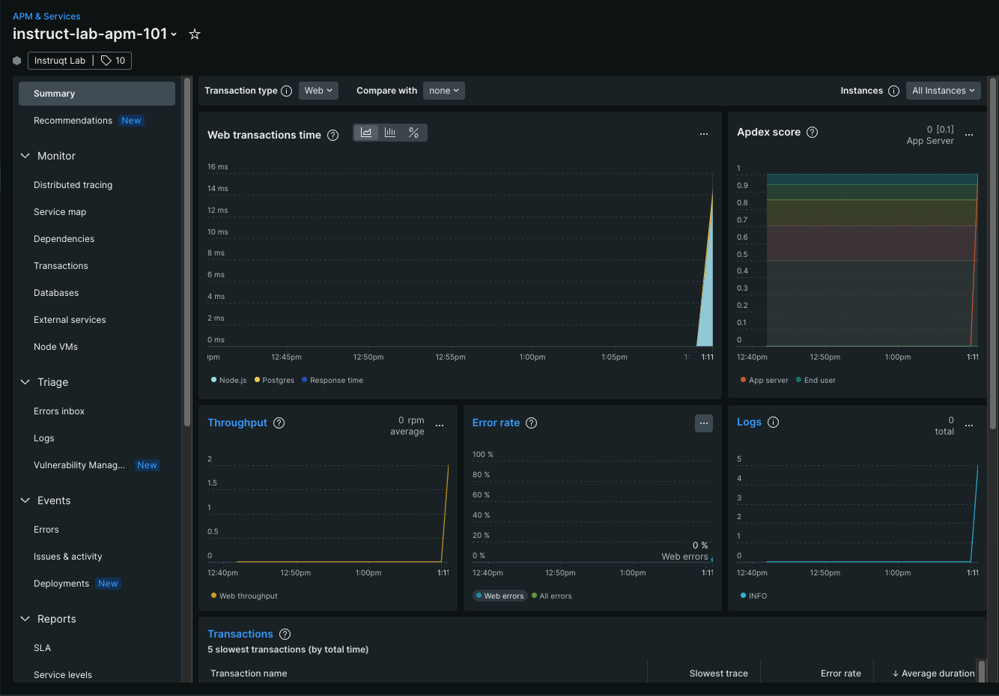

While you were on the loading screen, the environment was automatically set up:
- Node.js 24 and PostgreSQL installed
- App cloned to `/root/pern-newrelic/`
- Dependencies installed, database migrated and seeded

---

## Step 1 — Verify the environment

In [button label="Terminal 1"](tab-0), confirm Node is ready:

```run
node -v
```

You should see **v24.x.x**.

---

## Step 2 — Start and test the backend

Start the Express server:

```run
npm start
```

In [button label="Terminal 2"](tab-1), test the API:

```run
curl http://$HOSTNAME.$_SANDBOX_ID.instruqt.io:8080/api/tutorials
```

You should get a JSON array of tutorials. Check the [button label="Backend API"](tab-3) tab too.

Once verified, stop the server in [button label="Terminal 1"](tab-0) with `ctrl+c`.

---

## Step 3 — Install the New Relic APM agent

In [button label="Terminal 1"](tab-0):

```run
npm install newrelic
```

---

## Step 4 — Configure the agent

Open [button label="Editor"](tab-2) and open `newrelic.js`. Update these two values:

```js
app_name: ['backend-api-server'],
license_key: 'YOUR_LICENSE_KEY',
```

Replace `YOUR_LICENSE_KEY` with your **New Relic Ingest License key**.

> **Where to find it:** New Relic UI → top-right profile menu → **API Keys** → key with type **INGEST - LICENSE**.

Save the file.

---

## Step 5 — Enable APM in server.js

Open `server.js` in [button label="Editor"](tab-2) and add this as the **very first line**:

```js
const newrelic = require('newrelic');
```

> This must be line 1, before any other `require()` calls, so the agent hooks into the Node.js runtime at startup.

Save the file.

---

## Step 6 — Start the server and generate traffic

In [button label="Terminal 1"](tab-0), start the server:

```run
npm start
```

In [button label="Terminal 2"](tab-1), run the load generator:

```run
npm run load
```

> Press `ctrl+c` in [button label="Terminal 2"](tab-1) to stop the load generator when ready. Keep [button label="Terminal 1"](tab-0) running.

---

## Step 7 — Verify APM data in New Relic

Go to **[New Relic](https://one.newrelic.com) → APM & Services**.

Your app (`backend-api-server`) should appear within a few minutes. Click into it to explore:
- **Summary** — response time, throughput, error rate
- **Transactions** — every API endpoint, slowest calls
- **Distributed Tracing** — full request traces end-to-end

> It may take **2–3 minutes** for data to appear after the agent first connects.



> **Checkpoint ✅** Confirm you can see your app under APM & Services before moving to the next challenge.
