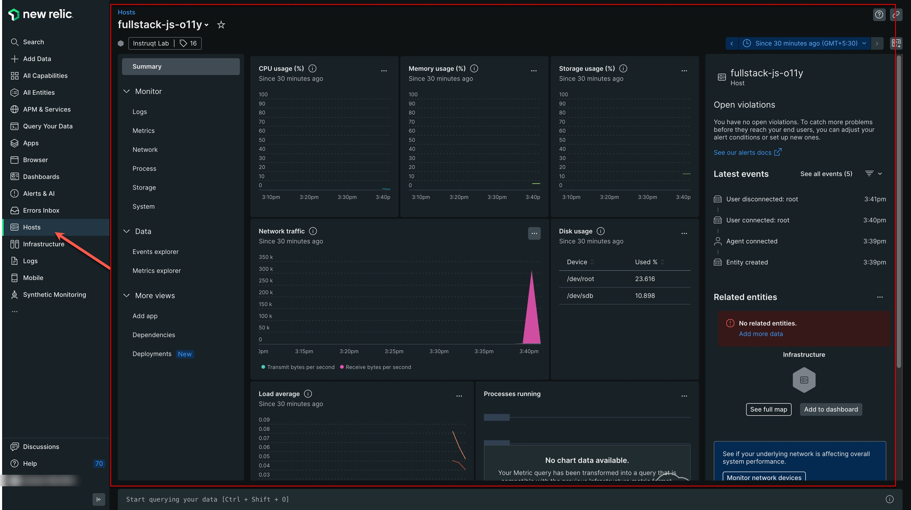
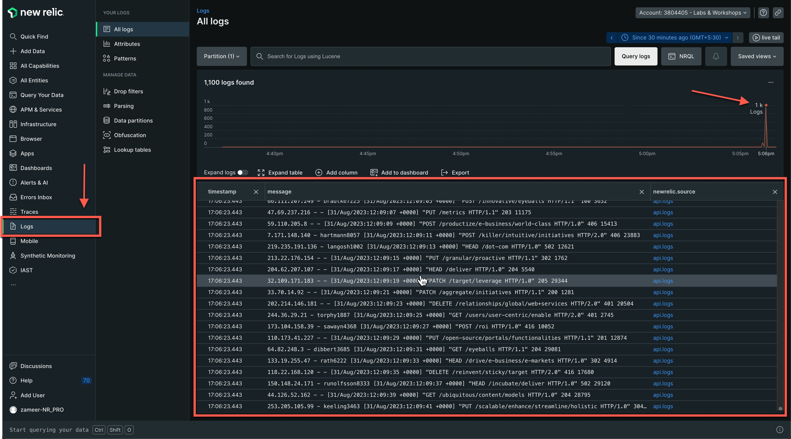
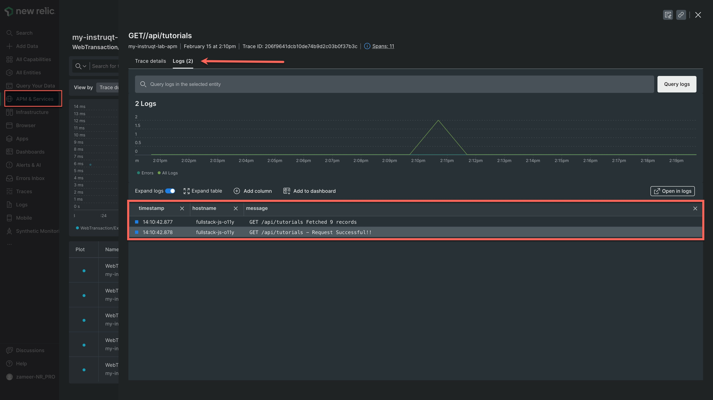

> The backend is starting automatically in the [button label="Node"](tab-1) tab. Wait until you see `Server is running on port 8080` before proceeding.

---

## Part A — Install the Infrastructure Agent

### Step 1 — Run the guided install

Run the following command in [button label="Terminal"](tab-0), replacing the placeholder values with your credentials:

```
curl -Ls https://download.newrelic.com/install/newrelic-cli/scripts/install.sh | bash && sudo NEW_RELIC_API_KEY=<YOUR_USER_KEY> NEW_RELIC_ACCOUNT_ID=<YOUR_ACCOUNT_ID> /usr/local/bin/newrelic install
```

> **Keys you need:**
> - `NEW_RELIC_API_KEY` — your **User Key** (starts with `NRAK-`). Find it: profile → **API Keys** → type = **USER**.
> - `NEW_RELIC_ACCOUNT_ID` — the number shown at the top of your API Keys page.

The guided install auto-detects your OS and sets up the Infrastructure agent as a systemd service.

---

### Step 2 — Decline the PostgreSQL integration

During the install, you will be prompted:

```
We've detected additional monitoring that can be configured:
  PostgreSQL Integration

? Continue installing?
```

**Select `No`** — we don't need the PostgreSQL integration for this workshop.

---

### Step 3 — Verify the agent is running

```run
systemctl status newrelic-infra --no-pager
```

You should see `active (running)`.

---

### Step 4 — Verify host data in New Relic

Go to **New Relic → Infrastructure → Hosts**.

Your host (`pern-o11y`) should appear within a few minutes showing CPU, memory, and disk metrics.



> **Checkpoint A ✅** Confirm the host appears under Infrastructure → Hosts before continuing.

---

## Part B — Send Custom Logs

The Infrastructure agent can forward any log file to New Relic. You just drop a config file into `/etc/newrelic-infra/logging.d/`.

### Step 1 — Create the log forwarding config

Run in [button label="Terminal"](tab-0):

```run
sudo tee /etc/newrelic-infra/logging.d/app-logs.yml > /dev/null <<EOF
logs:
  - name: pern-app-logs
    file: /tmp/dummy.log
EOF
```

### Step 2 — Restart the agent to load the new config

```run
sudo systemctl restart newrelic-infra
```

### Step 3 — Generate custom log data

`flog` is a pre-installed log generator. Run it to write 500 fake log lines to `/tmp/dummy.log`:

```run
flog -t log -n 500 -o /tmp/dummy.log
```

### Step 4 — Verify logs in New Relic

Go to **New Relic → Logs**. You should see log entries tagged with `pern-app-logs`.



> It may take **2–3 minutes** for the first batch to appear.

---

## Bonus — Logs-in-Context

Your APM agent (from Challenge 1) automatically links application logs to distributed traces.

In New Relic → **APM & Services** → your app → **Distributed Tracing**:
1. Click any trace
2. Select the **Logs** tab inside the trace view

You'll see the exact log lines emitted during that request — no manual correlation needed.



> **Checkpoint B ✅** Confirm you can see logs in New Relic Logs before moving to the next challenge.
